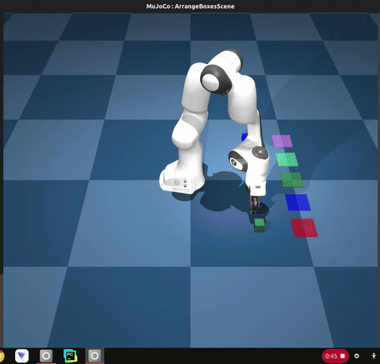
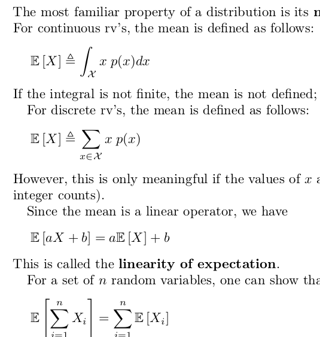
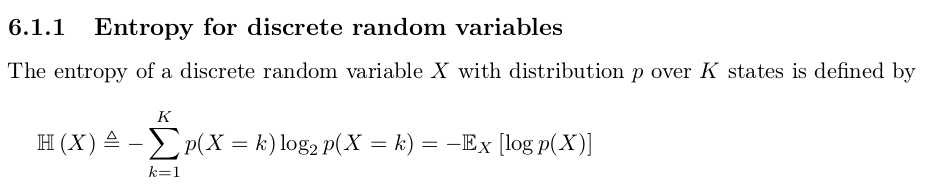
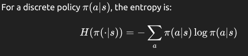
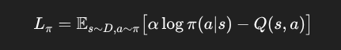
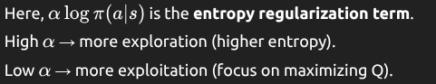
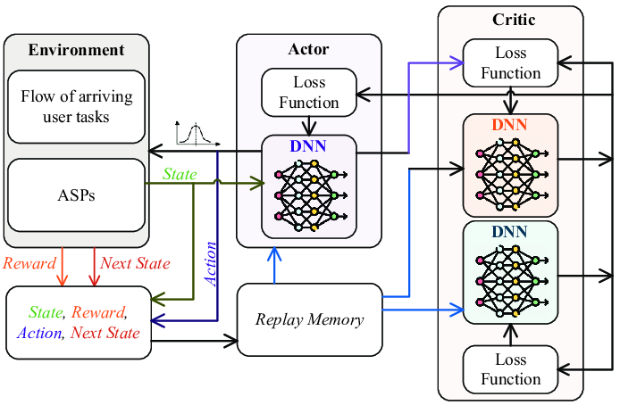
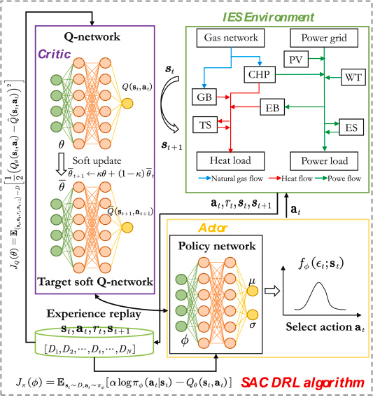

# gym-hil

A collection of gymnasium environments for Human-In-the-Loop (HIL) reinforcement learning, compatible with Hugging Face's LeRobot codebase.

## Overview

The `gym-hil` package provides environments designed for human-in-the-loop reinforcement learning. The list of environments are integrated with external devices like gamepads and keyboards, making it easy to collect demonstrations and perform interventions during learning.

Currently available environments:
- **Franka Panda Robot**: A robotic manipulation environment for Franka Panda robot based on MuJoCo

**What is Human-In-the-Loop (HIL) RL?**

Human-in-the-Loop (HIL) Reinforcement Learning keeps a human inside the control loop while the agent is training. During every rollout, the policy proposes an action, but the human may instantly override it for as many consecutive steps as needed; the robot then executes the human's command instead of the policy's choice. This approach improves sample efficiency and promotes safer exploration, as corrective actions pull the system out of unrecoverable or dangerous states and guide it toward high-value behaviors.


## Installation

Create a virtual environment with Python 3.10 and activate it, e.g. with [`miniconda`](https://docs.anaconda.com/free/miniconda/index.html):
```bash
conda create -y -n gym_hil python=3.10 && conda activate gym_hil
```

Install gym-hil from PyPI:
```bash
pip install gym-hil
```
or from source:
```bash
git clone https://github.com/HuggingFace/gym-hil.git && cd gym-hil
pip install -e .
```

## Franka Environment Quick Start

```python
import time
import imageio
import gymnasium as gym
import numpy as np

import gym_hil

# Use the Franka environment
env = gym.make("gym_hil/PandaPickCubeBase-v0", render_mode="human", image_obs=True)
action_spec = env.action_space

obs, info = env.reset()
frames = []

for i in range(200):
    obs, rew, done, truncated, info = env.step(env.action_space.sample())
    # info contains the key "is_intervention" (boolean) indicating if a human intervention occurred
    # If info["is_intervention"] is True, then info["action_intervention"] contains the action that was executed
    images = obs["pixels"]
    frames.append(np.concatenate((images["front"], images["wrist"]), axis=0))

    if done:
        obs, info = env.reset()

env.close()
imageio.mimsave("franka_render_test.mp4", frames, fps=20)
```

## Available Environments

### Franka Panda Robot Environments

Use keyboard for controlling the Franka Robot Cube env

```
python examples/test_arrangeboxes.py --use-keyboard
```

- **PandaPickCubeBase-v0**: The core environment with the Franka arm and a cube to pick up.
- **PandaPickCubeGamepad-v0**: Includes gamepad control for teleoperation.
- **PandaPickCubeKeyboard-v0**: Includes keyboard control for teleoperation.

## Teleoperation

For Franka environments, you can use the gamepad or keyboard to control the robot:

```bash
python examples/test_teleoperation.py
```

To run the teleoperation with keyboard you can use the option `--use-keyboard`.

### Human-in-the-Loop Wrappers

The `hil_wrappers.py` module provides wrappers for human-in-the-loop interaction:

- **EEActionWrapper**: Transforms actions to end-effector space for intuitive control
- **InputsControlWrapper**: Adds gamepad or keyboard control for teleoperation
- **GripperPenaltyWrapper**: Optional wrapper to add penalties for excessive gripper actions

These wrappers make it easy to build environments for human demonstrations and interactive learning.

## Controller Configuration

You can customize gamepad button and axis mappings by providing a controller configuration file.

```bash
python examples/test_teleoperation.py --controller-config path/to/controller_config.json
```

If no path is specified, the default configuration file bundled with the package (`controller_config.json`) will be used.

You can also pass the configuration path when creating an environment in your code:

```python
env = gym.make(
    "gym_hil/PandaPickCubeGamepad-v0",
    controller_config_path="path/to/controller_config.json",
    # other parameters...
)
```

To add a new controller, run the script, copy the controller name from the console, add it to the JSON config, and rerun the script.

The default controls are:

- Left analog stick: Move in X-Y plane
- Right analog stick (vertical): Move in Z axis
- RB button: Toggle intervention mode
- LT button: Close gripper
- RT button: Open gripper
- Y/Triangle button: End episode with SUCCESS
- A/Cross button: End episode with FAILURE
- X/Square button: Rerecord episode

The configuration file is a JSON file with the following structure:

```json
{
  "default": {
    "axes": {
      "left_x": 0,
      "left_y": 1,
      "right_x": 2,
      "right_y": 3
    },
    "buttons": {
      "a": 1,
      "b": 2,
      "x": 0,
      "y": 3,
      "lb": 4,
      "rb": 5,
      "lt": 6,
      "rt": 7
    },
    "axis_inversion": {
      "left_x": false,
      "left_y": true,
      "right_x": false,
      "right_y": true
    }
  },
  "Xbox 360 Controller": {
    ...
  }
}
```


## Acknowledgment

The Franka environment in gym-hil is adapted from [franka-sim](https://github.com/rail-berkeley/serl/tree/main/franka_sim) initially built by [Kevin Zakka](https://kzakka.com/).

## Version History

* v0: Original version

### used conda env

```
conda activate lerobot
```


### Manipulator for gym_hil with keyboard
```
 python -m lerobot.scripts.rl.gym_manipulator --config_path /home/skr3178/gym-hil/lerobot-example-config-files/gym_hil_env.json
 ```

- On one terminal, run command:

```
 python -m lerobot.scripts.rl.actor --config_path /home/skr3178/gym-hil/lerobot-example-config-files/train_gym_hil_env.json
```

- on the second terminal, run command:

```
 python -m lerobot.scripts.rl.learner --config_path /home/skr3178/gym-hil/lerobot-example-config-files/train_gym_hil_env.json
 ```

 With modification, one can control the robot continously using the keyboard, without having to press spacebar. Manual intervention does not require pressing the spacebar. Any control keyboard stroke would work. 

 The env is both sparse reward as well as dense reward based. 
 Inside gym_hil --> init.py has operations that allow the addition of new models to the env

 The code uses Franka robot arm for Human in the loop training. 
 Base training dataset is provided from Hugging face

 On top of that is the ACT policy used for training.
 There are couple of cameras which are used to track in the Mujoco env. 
 1. Wrist camera view
 2. Overall Top camera view

To open the different default or preset envs, use command: 
First activate env with mujoco 3.0 installed: 

```conda activate gym_mj```

```
python -m mujoco.viewer --mjcf=/home/skr3178/gym-hil/gym_hil/assets/arrange_boxes_scene.xml 
python -m mujoco.viewer --mjcf=/home/skr3178/gym-hil/gym_hil/assets/panda.xml
python -m mujoco.viewer --mjcf=/home/skr3178/gym-hil/gym_hil/assets/scene.xml
```

## To-Do:

- review the lowcost mujoco
- review gym-so101 module
- Create some more documentation on this. 
- How is the observation/observation-state defined.For example franka dataset has 18 obs features. Not sure where that is coming from

# Franka robot:
- 30 episodes
- 38 is the video frame size of episode 1. 
- actions are 4 [delta_x, delta_y, delta_z and delta_gripper]


### Gym human control



### GYM HIL control with keyboard control

Steps that are executed when running command:
```
 python -m lerobot.scripts.rl.learner --config_path /home/skr3178/gym-hil/lerobot-example-config-files/train_gym_hil_env.json
```

### Network arch setup:


```
python -m lerobot.scripts.rl.learner --config_path /home/skr3178/gym-hil/lerobot-example-config-files/train_gym_hil_env.json
```
1. Script Initialization
The learner script starts up and loads the configuration from train_gym_hil_env.json
It parses all the training parameters, network architectures, and environment settings

2. Network Architecture Setup
Based on the config, it creates:
SAC (Soft Actor-Critic) Policy: A reinforcement learning algorithm for continuous action spaces
Vision Encoder: ResNet10 model for processing camera images (front and wrist views)
Actor Network: 2 hidden layers with 256 dimensions each
Critic Network: 2 hidden layers with 256 dimensions each
State Encoder: 256-dimensional hidden layer for processing robot state information

3. Communication Server Setup
Port Configuration: Sets up a gRPC server on port 50051 (localhost:50051)
Actor-Learner Communication: Establishes the communication channel that the actor will use to send experience data

4. Buffer Initialization
Online Buffer: 100,000 experience tuples for online learning

- Purpose: Stores experience data collected during live training from the actor
- Content: Real-time observations, actions, rewards, and next states from the current training session
- Source: The actor process that's actively interacting with the environment
- Usage: Used for online learning - the learner continuously updates the policy based on this fresh data

Offline Buffer: 100,000 experience tuples from pre-recorded demonstrations

- Purpose: Stores pre-recorded demonstration data from human experts
- Content: High-quality demonstrations of the task (from the Hugging Face dataset aractingi/franka_sim_pick_lift_6)
- Source: Previously collected human demonstrations or successful task executions
- Usage: Used for offline learning - provides a foundation of good behavior before online training begins
- Data Flow: Pre-loaded dataset → Offline Buffer → Learner (for initial policy learning)

- FIFO (First-In-First-Out): When buffers reach capacity, oldest experiences are replaced
- Balanced Sampling: The learner samples from both buffers to create training batches
- Experience Replay: Allows the agent to learn from past experiences multiple times

Steps 1-100: Actor collects experience, learner stores it
No Network Updates: Policy stays unchanged
Buffer Building: Filling up to 100 samples

Experience Collection: Waits for the actor to start sending data

5. Training Loop Initialization
Learning Parameters:
Learning rate: 0.0003 for actor, critic, and temperature
Discount factor: 0.97
Policy update frequency: Every 1 step
Temperature initialization: 0.01
Network Updates: Sets up the update mechanisms for both actor and critic networks


On the fly training: 
Step 1: Collect 1 sample → Update networks → Deploy new policy
Step 2: Collect 1 sample → Update networks → Deploy new policy
Step 3: Collect 1 sample → Update networks → Deploy new policy

6. Waiting for Actor Data
The learner then enters a waiting state where it:
Listens for incoming experience data from the actor process
Receives observation-action-reward tuples
Stores them in the appropriate buffers
Waits until enough data is collected before starting learning

7. Learning Process
Once sufficient data is available:
Batch Processing: Samples batches of 256 experiences
Network Updates: Updates actor and critic networks using SAC algorithm
Target Updates: Updates target networks with soft updates (weight: 0.005)
Policy Improvement: Gradually improves the policy based on collected experience

8. Policy Distribution
Parameter Sharing: Every 4 steps, pushes updated policy parameters back to the actor
Continuous Learning: Maintains a continuous cycle of learning and policy 
improvement

9. Monitoring and Logging
Progress Tracking: Logs training progress every step
Checkpoint Saving: Saves model checkpoints every 2000 steps
Performance Metrics: Tracks various learning metrics and network performance

In json, for franka robot: 
        "output_features": {
            "action": {
                "type": "ACTION",
                "shape": [3]
            }
        }

### each action is allowed a +/-3 cm movement and there are three action elements [x, y, z]

With Soft-actor critic, there are 2 critics: 


Input (Images + State)
         ↓
   Shared Encoder (ResNet10)
         ↓
    ┌─────────────┐
    │    Actor    │ ← 1 network
    │  (Policy)   │
    └─────────────┘
         ↓
    ┌─────────────┐
    │   Critic 1  │ ← 2 networks
    │  (Q-Value)  │   (ensemble)
    └─────────────┘
         ↓
    ┌─────────────┐
    │   Critic 2  │
    │  (Q-Value)  │
    └─────────────┘
         ↓
    ┌─────────────┐
    │Temperature  │ ← 1 network
    │ (Entropy)   │
    └─────────────┘


### Soft -actor critic:

1. Actor in SAC

SAC has one stochastic policy network, called the actor.
Its job: output an action given a state 
This actor is stochastic, meaning it outputs a probability distribution (e.g., Gaussian for continuous actions), not just a single action.
The actor is trained to maximize expected reward + entropy.

2. Critics in SAC

SAC uses two Q-value networks (critics). This is called the twin Q trick.
Each critic (s,a) estimates the expected return for a given state-action pair.
Why two critics?
Reduces overestimation bias common in Q-learning.
Improves stability of training.
Both critics are updated with soft Bellman backups.

3. Target Critics
In addition to the two critics, SAC maintains target critic networks, which are slowly updated copies of the critics.
Purpose: provide stable Q-value targets during updates.

   



Entropy is a measure of uncertainty or randomness in a probability distribution.


If a policy is very deterministic (always picks the same action), entropy is low.


If a policy is more random (explores multiple actions), entropy is high.

Entropy Regularization Concept

In RL, instead of just maximizing expected reward, entropy regularization adds a bonus for high-entropy policies:


α>0 is a temperature parameter controlling the trade-off between reward and exploration.
The agent is encouraged to explore more, avoiding premature convergence to a suboptimal deterministic policy.

SAC explicitly maximizes a trade-off between expected reward and policy entropy.

The actor’s loss includes:








##