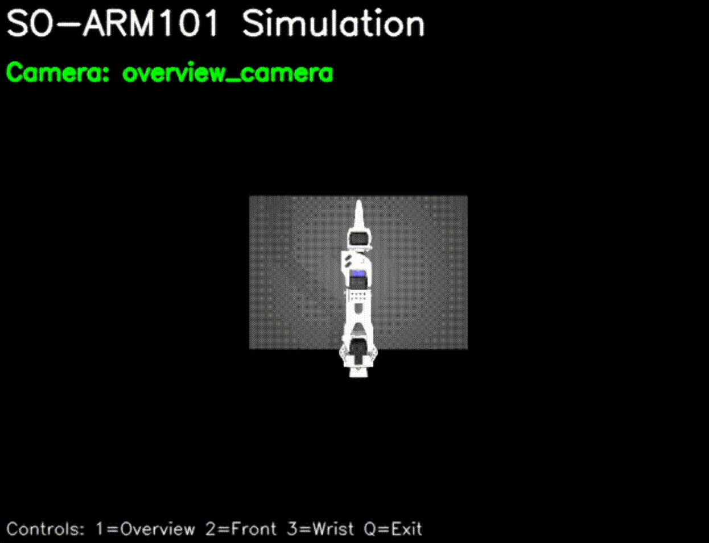

# Gym SO-ARM

A gymnasium environment for SO-ARM101 single-arm manipulation based on gym-aloha, featuring multi-camera support and advanced simulation capabilities.



## Features

- **SO-ARM101 6DOF Robotic Arm**: Complete simulation of the SO-ARM101 robotic manipulator with white color scheme
- **Multi-Camera System**: Three camera views with runtime switching:
  - Overview camera: Top-down perspective
  - Front camera: Side view of the workspace
  - Wrist camera: First-person view from the robot's gripper
- **Interactive GUI Viewer**: OpenCV-based viewer with keyboard controls
- **Grid-Based Object Placement**: 3×3 grid system for randomized object positioning
- **MP4 Video Recording**: Automatic recording of camera observations to timestamped MP4 files
- **6DOF Joint Control**: Direct control of all 6 joints including gripper via action space
- **Gymnasium Compatible**: Full OpenAI Gym/Gymnasium interface compliance
- **MuJoCo Physics**: High-fidelity physics simulation using dm-control

## Installation

### From Source

```bash
# Clone the repository
git clone https://github.com/your-org/gym-soarm.git
cd gym-soarm

# Install in development mode
pip install -e .

# Or install with development dependencies
pip install -e ".[dev,test]"
```

### Using pip

```bash
pip install gym-soarm
```

## Quick Start

### Basic Usage

```python
import gymnasium as gym
import gym_soarm

# Create environment with human rendering and camera configuration
env = gym.make('SoArm-v0', render_mode='human', obs_type='pixels_agent_pos', camera_config='front_wrist')

# Reset environment with specific cube position
obs, info = env.reset(options={'cube_grid_position': 4})

# The environment automatically records MP4 videos when using example.py
# Access joint positions and camera images
print(f"Joint positions: {obs['agent_pos']}")  # 6 joint values including gripper
print(f"Available cameras: {list(obs['pixels'].keys())}")  # front_camera, wrist_camera

# Run simulation with 6DOF joint control
for _ in range(200):
    action = env.action_space.sample()  # 6D action: [shoulder_pan, shoulder_lift, elbow_flex, wrist_flex, wrist_roll, gripper]
    obs, reward, terminated, truncated, info = env.step(action)
    
    if terminated or truncated:
        obs, info = env.reset()

env.close()
```

### Interactive Joint Control

For real-time joint manipulation using sliders, use the interactive control sample:

```bash
# Run the slider control sample
python examples/slider_control_final.py
```

**Features:**
- **Real-time Control**: Use trackbars to control each of the 6 joints (shoulder_pan, shoulder_lift, elbow_flex, wrist_flex, wrist_roll, gripper)
- **Visual Feedback**: Live display of joint angles in radians
- **Reset Functionality**: Reset button to return robot to initial position (all joints at 0.0 rad)
- **Keyboard Controls**: 
  - **SPACE**: Step simulation forward
  - **ESC**: Exit application
  - **R**: Quick reset shortcut

**Usage Instructions:**
1. Adjust joint angles using the trackbars at the top of the control window
2. Press SPACE to step the simulation and see the robot move
3. Use the "Reset" trackbar (set to 1) to reset the environment
4. Press ESC to exit the application

This sample is perfect for:
- Understanding joint limits and robot kinematics
- Manual robot positioning and pose testing
- Interactive exploration of the workspace
- Educational demonstrations of robotic arm control

### Grid Position Control

You can specify the initial position of the blue cube using a 3×3 grid system:

```python
import gymnasium as gym
import gym_soarm

env = gym.make('SoArm-v0', render_mode='human')

# Place cube at specific grid position (0-8)
obs, info = env.reset(options={'cube_grid_position': 4})  # Center position

# Use random position (default behavior)
obs, info = env.reset(options={'cube_grid_position': None})
```

**Grid Layout (positions 0-8):**
```
0: (-10cm, -7.5cm)  1: (-10cm,  0cm)   2: (-10cm, +7.5cm)
3: ( 0cm,  -7.5cm)  4: ( 0cm,   0cm)   5: ( 0cm,  +7.5cm)  
6: (+10cm, -7.5cm)  7: (+10cm,  0cm)   8: (+10cm, +7.5cm)
```

The cube will be placed at the specified grid position with a random rotation (0°, 30°, 45°, or 60°).

### Camera Configuration

You can configure which cameras are included in observations to optimize performance and focus on relevant viewpoints:

```python
import gymnasium as gym
import gym_soarm

# Front camera only (minimal, fastest)
env = gym.make('SoArm-v0', obs_type='pixels', camera_config='front_only')

# Front and wrist cameras (default, balanced)
env = gym.make('SoArm-v0', obs_type='pixels', camera_config='front_wrist')

# All cameras (comprehensive, slower)
env = gym.make('SoArm-v0', obs_type='pixels', camera_config='all')

obs, info = env.reset()
print(f"Available cameras: {list(obs.keys())}")
```

**Camera Configuration Options:**
- `front_only`: Only front camera (side view) - fastest, minimal observations
- `front_wrist`: Front camera + wrist camera (first-person view) - balanced performance
- `all`: All three cameras (overview + front + wrist) - comprehensive but slower

**Observation Structure by Configuration:**
```python
# front_only
obs = {
    'front_camera': np.ndarray(shape=(480, 640, 3))
}

# front_wrist  
obs = {
    'front_camera': np.ndarray(shape=(480, 640, 3)),
    'wrist_camera': np.ndarray(shape=(480, 640, 3))
}

# all
obs = {
    'overview_camera': np.ndarray(shape=(480, 640, 3)),
    'front_camera': np.ndarray(shape=(480, 640, 3)),
    'wrist_camera': np.ndarray(shape=(480, 640, 3))
}
```

### MP4 Video Recording

The `example.py` script automatically records camera observations to MP4 videos:

```python
import gymnasium as gym
import gym_soarm

# Run the example script with video recording
env = gym.make('SoArm-v0', render_mode='human', obs_type='pixels_agent_pos', camera_config='front_wrist')

# Videos are automatically saved to videos/ directory with timestamps
# - front_camera_20250729_143022.mp4
# - wrist_camera_20250729_143022.mp4

# Manual video recording can be implemented using:
frames_storage = {}
obs, info = env.reset()

# Store frames from each camera
if "pixels" in obs:
    for camera_name, frame in obs['pixels'].items():
        if camera_name not in frames_storage:
            frames_storage[camera_name] = []
        frames_storage[camera_name].append(frame.copy())

# Use save_frames_to_mp4() function from example.py to save videos
```

### Camera Switching

During simulation with `render_mode='human'`, use these keyboard controls:

- **'1'**: Switch to overview camera
- **'2'**: Switch to front camera  
- **'3'**: Switch to wrist camera
- **'q'**: Quit simulation

## Environment Details

### Observation Space

The environment provides rich observations including:

- **Robot Joint Positions**: 6DOF joint positions including gripper (6-dimensional)
- **Camera Images**: RGB images from configured cameras (480×640×3 each)
- **Object Information**: Positions and orientations of manipulated objects

```python
# For obs_type='pixels_agent_pos'
obs_space = gym.spaces.Dict({
    'agent_pos': gym.spaces.Box(-np.inf, np.inf, shape=(6,), dtype=np.float64),  # Joint positions
    'pixels': gym.spaces.Dict({
        'front_camera': gym.spaces.Box(0, 255, shape=(480, 640, 3), dtype=np.uint8),
        'wrist_camera': gym.spaces.Box(0, 255, shape=(480, 640, 3), dtype=np.uint8)
    })
})
```

### Action Space

6DOF joint position control for the SO-ARM101:

- **Dimensions**: 6 (shoulder_pan, shoulder_lift, elbow_flex, wrist_flex, wrist_roll, gripper)
- **Range**: Joint-specific limits based on hardware specifications
- **Control**: Direct joint position targets

### Workspace Configuration

- **Table Size**: 64cm × 45cm
- **Object Grid**: 3×3 positioning system with ±10cm(X), ±7.5cm(Y) spacing
- **Cube Size**: 3cm × 3cm × 3cm blue cubes
- **Robot Base**: Positioned at (0, 0.15, 0) with 90° rotation
- **Robot Color**: White color scheme with black servo motors for visual clarity

### Camera Specifications

| Camera | Position | Orientation | FOV | Description |
|--------|----------|-------------|-----|-------------|
| Overview | (0, 0.4, 0.8) | Top-down | 90° | Bird's eye view |
| Front | (0, 0.7, 0.25) | Angled forward | 120° | Side perspective |
| Wrist | (0, -0.04, 0) | 30° X-rotation | 110° | First-person view |

## Development

### Project Structure

```
gym-soarm/
├── gym_soarm/              # Main package
│   ├── __init__.py        # Package initialization
│   ├── env.py            # Main environment class
│   ├── constants.py      # Environment constants
│   ├── assets/           # Robot models and scenes
│   │   ├── so101_new_calib.xml    # SO-ARM101 robot model (white color)
│   │   ├── so_arm_main_new.xml    # Scene with table and objects
│   │   └── assets/               # STL mesh files
│   └── tasks/            # Task implementations
│       ├── __init__.py
│       └── sim.py        # Manipulation tasks
├── examples/             # Example scripts and demonstrations
│   ├── example.py        # Basic usage with MP4 recording
│   └── slider_control_final.py  # Interactive joint control with sliders
├── videos/               # Auto-generated MP4 video outputs
├── setup.py             # Package setup
├── pyproject.toml       # Poetry configuration
└── README.md            # This file
```

### Running Tests

```bash
# Install test dependencies
pip install -e ".[test]"

# Run comprehensive test suite
pytest tests/ -v

# Run specific test categories
pytest tests/test_e2e.py -v              # End-to-end tests
pytest tests/test_camera_config.py -v    # Camera configuration tests

# Run basic functionality test
python examples/example.py

# Test interactive joint control
python examples/slider_control_final.py

# Test camera configuration features
python test_camera_features.py
```

### Code Style

The project uses Ruff for linting and formatting:

```bash
# Install development dependencies
pip install -e ".[dev]"

# Run linting
ruff check gym_soarm/

# Auto-format code
ruff format gym_soarm/
```

## Hardware Requirements

- **Python**: ≥3.10
- **OpenGL**: Required for rendering
- **Memory**: ≥4GB RAM recommended
- **Storage**: ~500MB for assets and dependencies

## Troubleshooting

### Common Issues

1. **MuJoCo Installation**: Ensure MuJoCo ≥2.3.7 is properly installed
2. **OpenGL Context**: On headless systems, use `xvfb-run` for rendering
3. **Asset Loading**: Verify all `.stl` files are present in `assets/assets/`

### Platform-Specific Notes

- **macOS**: May require XQuartz for OpenGL support
- **Linux**: Ensure proper GPU drivers for hardware acceleration
- **Windows**: Use WSL2 for best compatibility

## Citation

If you use this environment in your research, please cite:

```bibtex
@software{gym_soarm,
  title={Gym SO-ARM: A Gymnasium Environment for SO-ARM101 Manipulation},
  author={SO-ARM Development Team},
  version={0.1.0},
  year={2024},
  url={https://github.com/your-org/gym-soarm}
}
```

## License

Apache 2.0 License - see [LICENSE](LICENSE) file for details.

## Contributing

Contributions are welcome! Please read our contributing guidelines and submit pull requests to our GitHub repository.

## Support

For questions and support:
- GitHub Issues: [Report bugs or request features](https://github.com/your-org/gym-soarm/issues)
- Discussions: [Community discussions](https://github.com/your-org/gym-soarm/discussions)